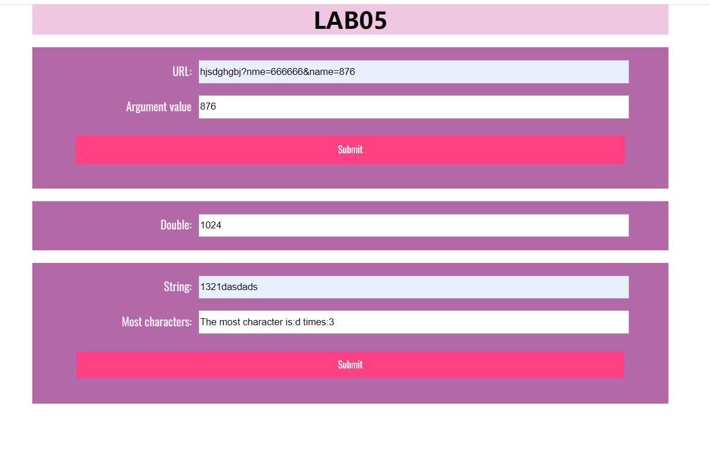
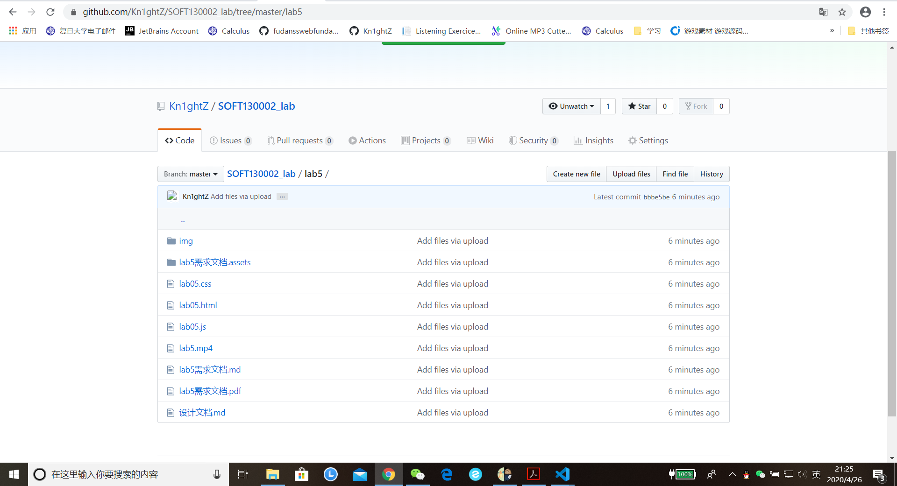

# Lab5设计文档
姓名： 陆勇雍  
学号： 19302010034

## 相关知识点与解决方案   
### 1.获取url中名为name的参数  
函数相关知识点有：charAt(), substring()， slice() 。  
其中碰到了这样一个问题，多重循环下break只能跳出当前的循环，而如果想要跳出全部循环，通过百度查得可以 通过自定义标签 break label 跳出整个循环。  
### 解决方案：
对于形如hjsdghgbj?name=666666&group=876的字符串，要读取name的值
可以先通过循环遍历字符串，定位到其中的'？'所在的位置，再通过substring方法遍历每五个字符组成的字符串是否为'name=',最后把符合条件的字符串筛选出来，通过循环，拼接成一个新的字符串（即所需要的name值），这个循环在识别到'&'字符结束。最后输出结果。

### 2.每隔5s运行一次函数  
函数相关知识点有：setInterval()，clearIntval(), getSeconds()等。  
### 解决方案；
通过setInterval设置每5s运行一次函数
首先分为两种情况，开始时的秒数小于等于10，开始时的秒数大于10。
当开始时的秒数小于等于10，这意味着函数运行十次，那么就需要先定义一个次数为10，每运行一次函数次数减少1，当次数为0时，设置clearInterval清除，防止无限的调用函数。同理，开始时的秒数大于10，意味着函数运行次数少于十次，根据公式 次数=（60-开始秒数）/5 可以得出次数，后面的部分跟第一种情况一样。

### 3.判断最多的字符
函数相关知识点有：charAt().
### 解决方案：
循环遍历字符串，并创建一个数组记录各个字符出现的次数。之后再通过比较各个次数之间的大小，得到出现次数最多的字符和次数，最后输出结果。

## 网页效果截图

## github 截图

