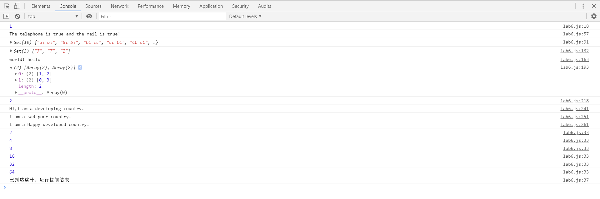

# Lab6设计文档

姓名：陆勇雍

学号：19302010034

## ①各个正则表达式的解释

1. 移动电话号码：  
`/^1(3[4-9]|4[478]|5[012789]|7[28]|8[23478]|9[8])\d{8}$/ `  
经查得移动号码前三位为134 135 136 137 138 139 144 147 148 150 151 152 157 158 159 172 178 182 183 184 187 188 198  
"/ /"代表正则表达式；"^"表示起始位置；"$"表示结束位置；"[4-9]"表示4至9之间的任意一个；"[478]"表示4、7、8中任意一个；"|"表示或者；"\d{8}"表示8位数字；所以“1(3[4-9]|4[478]|5[012789]|7[28]|8[23478]|9[8])”代表前三位要属于移动号码；"\d{8}"代表后8位为任意数字。

2. 邮箱：  
`/^[a-zA-Z0-9_-]+@[a-zA-Z0-9_-]+(\.[a-zA-Z0-9_-]+)+$/`  
邮箱型式为：xxx@xxx.xxx.xxx  
"[a-zA-Z0-9_-]+"表示字母数字下划线连接符一共至少一个或多个，即代表第一个xxx  
"(\.[a-zA-Z0-9_-]+)+"表示.xxx至少一个或多个

3. 相邻重复单词：  
`/\b([a-z]+) \1\b/i`  
"[a-z]+"表示a至z一共至少一个或多个；"\1"表示与第一个子匹配项形式相同，即与括号内的"[a-z]+"形式相同；"\b"表示一个单词的边界；"i"表示不区分大小写。
如"aa aa"
## ②继承不同方式的理解
原型链继承即让新实例的原型等于父类的实例，缺点是继承单一，并且当一个实例改变了原型属性，其他实例的原型属性也会被改变；    
借用构造函数继承用call（）将父类构造函数引入子类构造函数，可以向父类传参，但只能继承父类构造函数的属性，无法实现构造函数的复用；    
组合继承结合了两种模式的优点，可以传参，可以函数复用，也保证每个实例都有它自己的属性，是最常用的继承模式，但是调用了两次父类构造函数，消耗内存；    
原型式继承用一个函数包装一个对象，返回这个函数的调用，类似于复制一个对象，object.create()方法规范化了原型式继承；    
寄生式继承与寄生构造函数和工厂模式类似，创建一个仅用于封装继承过程的函数，在函数内部增强对象，再返回对象，任何能够返回新对象的函数都适用于此模式；    
寄生组合式继承用过借用构造函数来继承属性，用过原型链的混成形式来继承方法，集寄生式继承和组合继承的优点于一身。

## ③Map、Set、Array之间的区别和使用
Map是一组键值对的结构，具有极快的查找速度，值与值的一种对应。所以在6、7两题，均是用map同时存储字符/数字与其对应的下标，这样查找时可以根据字符/数字进行更快的查找。  
Set对象可以存储任何类型的唯一值，即set中的元素不能重复。在3、4两题，可以先把结果放到一个array中，在利用set可以去重，把array转换成set，最后输出的array再由set转换而来。
Array对象用于在变量中存储多个值，也就是数组，存储的类型不限。相比java的数组更加方便。感觉更基本，也更常用。但配合map、set使用可以提高效率。

## 截图

